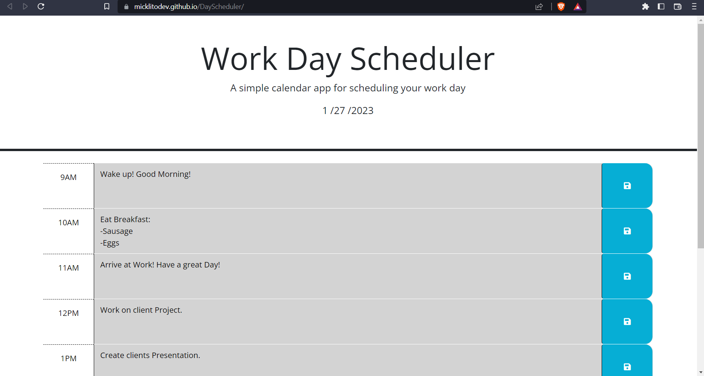
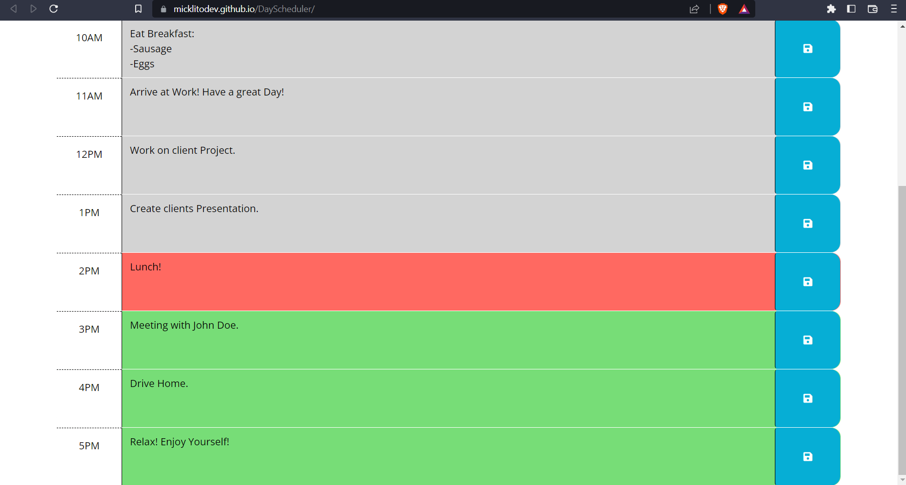

# JqueryDayScheduler 

## Link

Click [- here -](https://micklitodev.github.io/JQueryDayScheduler/) to go to the live link.

## ScreenShot

## Description

Please read each section to better understanding of the idea behind this project.

- Jquery is the primary used language to build this application. 

- Why did you build this project? To better manage my time during work hours
  and to Better display my skills and assets as a software developer
  to hiring jobs and companies. 

- What problem does it solve? This application can be used to manage 
  time at work. It uses a simple model of only 9am - 5pm. 

## Usage

To use this application,

- Upon loading the page you will see that it has a color pattern of grey, red, green.  Gray indicates
  that the time has passed, red for current hour, green for future hour. App constantly moniters time
  and changes dynamically as it progresses. All local storage data will be reset after final hour (6pm). To start using
  simply enter in text to the feild and then click the save button, data persistance will keep the data.
  Untill reset at 6pm every night. Feilds will change back to future from past after 12PM. 

- Enjoy!

Thank you!

## Credits

-Michael Lito

## License

none

---